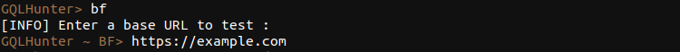
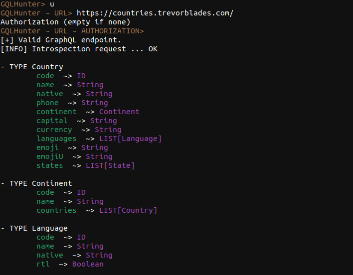
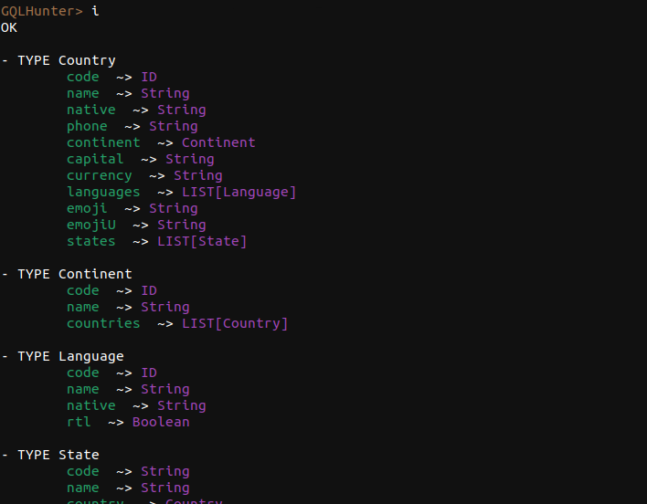
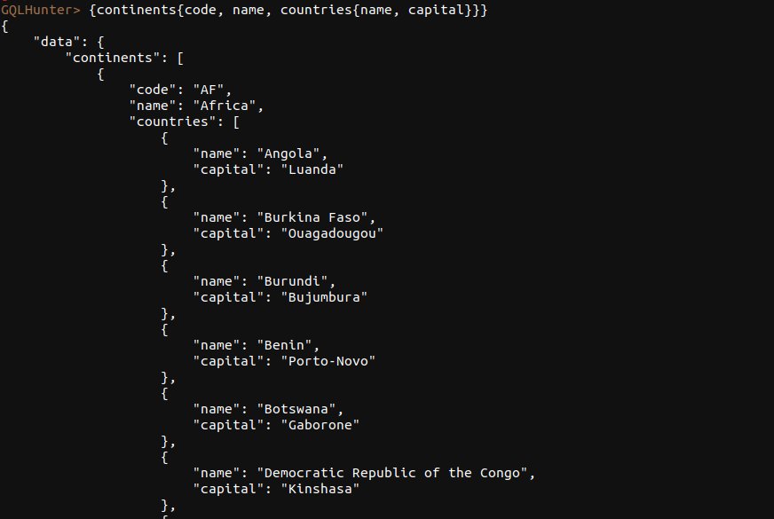

# GraphQLHunter

[](https://www.python.org/) [](https://opensource.org/licenses/MIT) 

GraphQLHunter is a interactive python tool that allows you to find and test GraphQL endpoints, perform introspection, injection and execute queries.

> **Avertissement :** Use of this software is entirely at your own risk. The author shall not be liable for any loss, damage or injury, direct or indirect, arising from the use of this software. By downloading, installing or using this software, you fully and expressly accept the terms of this disclaimer.


## Features

- Bruteforce directory to find GraphQL endpoint
- Setup an proxy for perform backend injection
- Test an user-specified URL to check if it is a valid GraphQL endpoint
- Perform introspection on a valid GraphQL endpoint to see all available types and fields
- Execute a specified query on a valid GraphQL endpoint

## Installation

Make sure you have [Python 3.x](https://www.python.org/downloads/) installed on your computer
Download or clone the project repository using git command: 

```
git clone https://github.com/coutand-bastien/graphQLHunter.git
```

Navigate to the project directory:

```
cd graphQLHunter
```

Install the required dependencies using pip:

```
pip3 install -r requirements.txt
```

## Usage

```
python3 GraphQLHunter.py
```

## Options

- `h`, `help`: Show help message and exit
- `p`, `proxy` : set proxy
- `bf`, `bruteforce`: Bruteforce a base URL to find the GraphQL endpoint
- `u`, `url`: Test a userspecified URL
- `i`, `intro`: Perform introspection on the endpoint
- `<query>`: Execute a specified query on the endpoint
- `exit`: Exit the program


## Commands examples

Bruteforce a base URL and find the GraphQL endpoint:



Test a user-specified URL:



Perform introspection on the endpoint:



Execute a specified query on the endpoint:




## The proxy command 

The proxy command allows you to configure a proxy to use payload-lists and send requests to graphQL endpoints more easily.

A client has been provided for you to use this feature. See [client.py](client.py)

<br>

# 🚀 In the futur
- [ ] Visualisation with graphQLVoyager

<br>

# Crédits

- [SecLists](https://github.com/danielmiessler/SecLists) - GraphQL endpoints wordlists by danielmiessler.
<br>

# License

This project is licensed under the [MIT license](LICENSE).